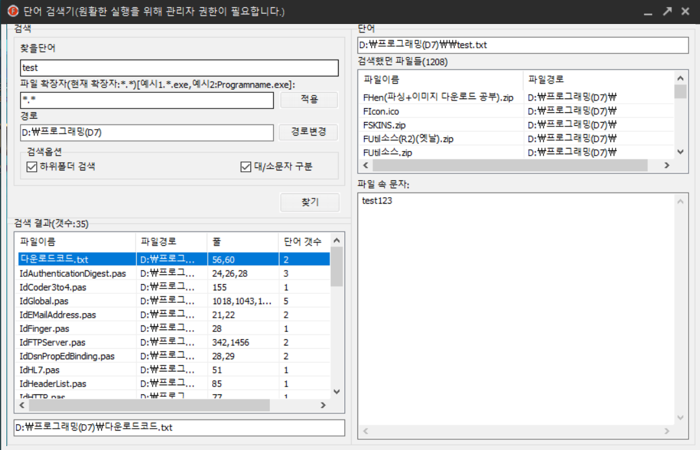

# Finder

과거 개발을 하며 가장 불편했던 점은 특정 함수, 변수, 특정 단어를 찾기 위해서 여러 모든 파일을 직접 열어보곤 하였습니다.

비효율적으로 파일을 하나하나 열어보면서 '**이렇게 찾는 거 너무 비효율적이다. 특정 단어를 쉽게 찾아내는 프로그램을 만드어보자!**'라는 생각이 들어 이 프로그램을 개발하게 되었습니다.

# 프로그램 이미지

**※ D:\프로그래밍(D7) 경로에 있는 모든 하위 디렉토리, 파일들을 모두 열어 test라는 단어가 포함된 파일을 모두 찾아내는 프로그램**

